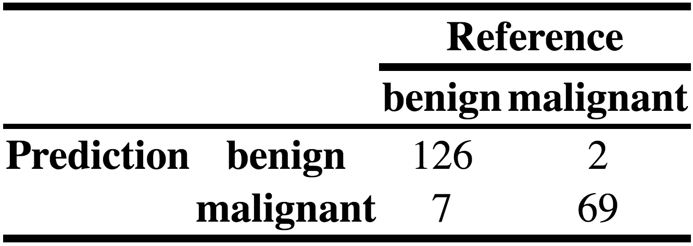

[//]: # (
http://www.w3schools.com/css/css_font.asp
http://www.cssfontstack.com/Helvetica
)

<style>
/* gdbar size (that contains logo) on title page */
/* needs to have greater height than logo image, other stuff is irrelevant */
.gdbar {
  position:absolute !important;
  top: 50px !important; left: auto; right: 0px !important; width: 0px !important;
  height: 500px !important;  /* modify if logo is larger than this in height */
}

/* logo size on title page */
.gdbar img {
  position: absolute; 
  top: 0px;
  left: 50px;
  width: 500px !important;
  height: 220px !important;
}
/*77 64*/
/* logo size on slides */
slides > slide:not(.nobackground):before {
  width: 200px; height: 88px; /* modify width and height (twice) */
  background-size: 200px 88px;
  position: absolute; left: auto;
  right: -30px;  /* modify position */
  top: 10px;
}

/* for slides with red background (only works for normal text, not whole slide) {.bgred} */
.bgred,
.bgred div,
.bgred body,
.bgred .article,
.bgred article,
.bgred .prettyprint,
.bgred .h1,
.bgred .h2,
.bgred .h3,
.bgred backdrop,
.bgred .backdrop,
.bgred .slide,
.bgred slide,
.bgred slides > slide.backdrop {   
  background-color:#ffaaaa;
  background:#ffaaaa;
}

.footer {
    position: fixed;
    top: 70%;
    width:100%;
}

/*slides > slide.backdrop {   */
/*  background-color:#ffaaaa;   */
/*  background:#ffaaaa;   */
/*}   */
</style>

```{r setup, include=FALSE}
knitr::opts_chunk$set(echo = TRUE)

#------------------------------------------------------------------#
# function to add alpha to a color
#------------------------------------------------------------------#
add_alpha <- function(col, alpha = 1){
  if(missing(col))
    stop("Please provide a vector of colours.")
  apply(sapply(col, col2rgb)/255, 2, 
        function(x) 
          rgb(x[1], x[2], x[3], alpha=alpha))  
}

```

## Contents

- Introduction to the authors
- Motivation: Why develop the package?
- What are HTML tables?
- What is tableHTML?
- Basic syntax & features of tableHTML
- add_css_*() family of functions
- Conditional formatting
- Themes
- confution matrix

## Introduction to the authors

### Theo Boutaris

Theo is a Data Scientist currently residing in the UK. He has a passion for statistics and coding, which naturally led him to follow the Data Science path. He is an R evangelist and open source supporter and tries to give back to the community in his free time. He originates from the great city of Thessaloniki in Greece. When not coding, he plays football, listens to music or plays Dota2.


### Clemens Zauchner

Studied business informatics in Innsbruck and data science in London. Worked with companies like OMV, easyJet, and Sainsbury’s. Currently Data Scientist @ The Unbelievable Machine Company. Co-author of open source R package tableHTML, a tool to create and style HTML tables from R.

## Motivation: Why develop the package?

- Development started in 2016
- While developing a [football app](https://lyzander.shinyapps.io/FootballeR/) using shiny, it was somewhat difficult to build a pretty HTML table
- Example: drawing vertival lines every three columns seemd like a difficult task
- even using great packages like `xtable`


## What is tableHTML?

- A package for building CSS-ible HTML tables in an easy and intuitive way
- Compatible with any application that accepts HTML (e.g. shiny, rmarkdown, Outlook, PowerPoint, Word)
- The main function tableHTML converts a data.frame or matrix or any other object that can be converted into a data.frame into an HTML table
- Using the function on R Studio will print the table on the viewer otherwise it will use the default browser
- The default tables are built without any CSS in order to allow for full flexibility although two themes are included
- Re-exports the pipe `%>%` operator

## What are HTML tables?

```{HTML}
<table style="width:100%">
  <thead>
    <tr>
      <th>Firstname</th>
      <th>Lastname</th>
      <th>Age</th>
    </tr>
  </thead>
  <tbody>
    <tr>
      <td>Jill</td>
      <td>Smith</td>
      <td>50</td>
    </tr>
    <tr>
      <td>Eve</td>
      <td>Jackson</td>
      <td>94</td>
    </tr>
  </tbody>
</table>
```

## Basic syntax

```{r basic_syntax}

library(tableHTML)

mtcars %>% 
  head(5) %>% 
  tableHTML(widths = c(140, rep(50, 11)))
```


## Features of tableHTML 

- New headers
- Second headers
- Row names
- Row groups
- Add a caption / footer

<br>

```{r remove_row_names_code, eval = FALSE}
mtcars %>% 
  head(14) %>% 
  tableHTML(widths = c(120, 140, rep(45, 11)),
            second_headers = list(c(2, 2, 4, 5), c('', 'col1', 'col2', 'col3')),
            row_groups = list(c(7, 7), c('Group1', 'Group2')),
            caption = 'This is a caption',
            footer = 'This is a footer')

```

## Example 

```{r remove_row_names_table, echo = FALSE}
mtcars %>% 
  head(14) %>% 
  tableHTML(widths = c(120, 140, rep(45, 11)),
            second_headers = list(c(2, 2, 4, 5), c('', 'col1', 'col2', 'col3')),
            row_groups = list(c(7, 7), c('Group1', 'Group2')),
            caption = 'This is a caption',
            footer = 'This is a footer')

```

## Adding a table class

- The class argument sets the class name for the table
- The default will be of the form table_xxx (random 4-digit number)
- This makes it easier to add css to it in case there are multiple tables

```{r css_class}
mtcars %>% 
  tableHTML(widths = c(140, rep(50, 11))) %>% 
  str()
```

## The add_css_*() family of functions

Currently the package offers the following add_css functions which add CSS to their respective part of the HTML table:

- add_css_caption
- add_css_column
- add_css_conditional_column
- add_css_footer
- add_css_header
- add_css_row
- add_css_second_header
- add_css_table
- add_css_tbody
- add_css_thead

## Example of how some of the add_css_* <br> functions can be used

```{r css_example_code, eval = FALSE}
mtcars[1:15, ] %>%
  tableHTML(widths = c(140, rep(45, 11)),
            second_headers = list(c(3, 4, 5), 
                                  c('team1', 'team2', 'team3')),
            caption = 'Table of Cars',
            footer = 'Figure 1. Stats for famous cars') %>% 
  add_css_second_header(css = list(c('height', 'background-color', 'font-size'), 
                                   c('40px', ' #e6e6e6', '30px')),
                        second_headers = 1:3) %>%
  add_css_header(css = list(c('height', 'background-color'), 
                            c('30px', ' #e6e6e6')),
                 headers = 1:12) %>%
  add_css_row(css = list('background-color', '#f2f2f2'),
              rows = even(1:17)) %>%
  add_css_row(css = list('background-color', '#e6f0ff'),
              rows = odd(1:17)) %>%
  add_css_column(css = list('text-align', 'center'), 
                 columns = names(mtcars)) %>%
  add_css_caption(css = list(c('text-align', 'font-size', 'color'),
                             c('center', '20px', 'black'))) %>%
  add_css_footer(css = list(c('text-align', 'color'),
                            c('left', 'black')))
```

## Example of how some of the add_css_* <br> functions can be used

```{r css_example_table, echo = FALSE}
mtcars[1:5, ] %>%
  tableHTML(widths = c(140, rep(45, 11)),
            second_headers = list(c(3, 4, 5), 
                                  c('team1', 'team2', 'team3')),
            caption = 'Table of Cars',
            footer = 'Figure 1. Stats for famous cars') %>% 
  add_css_second_header(css = list(c('height', 'background-color', 'font-size'), 
                                   c('40px', ' #e6e6e6', '30px')),
                        second_headers = 1:3) %>%
  add_css_header(css = list(c('height', 'background-color'), 
                            c('30px', ' #e6e6e6')),
                 headers = 1:12) %>%
  add_css_row(css = list('background-color', '#f2f2f2'),
              rows = even(1:7)) %>%
  add_css_row(css = list('background-color', '#e6f0ff'),
              rows = odd(1:7)) %>%
  add_css_column(css = list('text-align', 'center'), 
                 columns = names(mtcars)) %>%
  add_css_caption(css = list(c('text-align', 'font-size', 'color'),
                             c('center', '20px', 'black'))) %>%
  add_css_footer(css = list(c('text-align', 'color'),
                            c('left', 'black')))
```

## Conditional formatting

```{r cond_formatting_code, eval = FALSE}
mtcars %>% 
  head(10) %>% 
  tableHTML(widths = c(140, rep(45, 11))) %>% 
  add_css_conditional_column(conditional = ">=",
                             value = 300,
                             css = list("background-color", 
                                        add_alpha("red", 0.5)),
                             columns = 3) %>% 
  add_css_conditional_column(conditional = "between",
                             between = c(15, 17),
                             css = list("background-color", 
                                        add_alpha("orange", 0.5)),
                             columns = 7) %>% 
  add_css_conditional_column(conditional = "min",
                             css = list("background-color", 
                                        add_alpha("green", 0.5)),
                             columns = 4:6,
                             same_scale = FALSE)
```

## Conditional formatting

```{r cond_formatting_table, echo = FALSE}
mtcars %>% 
  head(10) %>% 
  tableHTML(widths = c(140, rep(45, 11))) %>% 
  add_css_conditional_column(conditional = ">=",
                             value = 300,
                             css = list("background-color", 
                                        add_alpha("red", 0.5)),
                             columns = 3) %>% 
  add_css_conditional_column(conditional = "between",
                             between = c(15, 17),
                             css = list("background-color", 
                                        add_alpha("orange", 0.5)),
                             columns = 7) %>% 
  add_css_conditional_column(conditional = "min",
                             css = list("background-color", 
                                        add_alpha("green", 0.5)),
                             columns = 4:6,
                             same_scale = FALSE)
```


## Colour ranking

```{r colour_rank_code}
set.seed(1234)
matrix(sample(1:5, 50, replace = TRUE), ncol = 10) %>% 
tableHTML(widths = rep(45, 10),
          rownames = FALSE) %>% 
  add_css_conditional_column(colour_rank_theme = "RAG",
                             columns = 1:10)
```

## Built-in themes

```{r scientific}
mtcars %>% 
  head(5) %>% 
  tableHTML(widths = c(140, rep(45, 11)),
            theme = "scientific")
```

## Built-in themes

```{r rshiny-blue}
mtcars %>% 
  head(5) %>% 
  tableHTML(widths = c(140, rep(45, 11)),
            theme = "rshiny-blue")
```


## Confusion Matrix

```{r data_prep, eval = FALSE, echo=FALSE, warning=FALSE, message=FALSE}
library(dplyr)
library(caret)

data(BreastCancer, package = "mlbench")

bc <- BreastCancer[complete.cases(BreastCancer), ] 


# remove id column
bc <- bc[,-1]

# convert factors to numeric
for(i in 1:9) {
  bc[, i] <- as.numeric(as.character(bc[, i]))
}

set.seed(100)
trainDataIndex <- createDataPartition(bc$Class, p = 0.7, list = FALSE)
trainData <- bc[trainDataIndex, ]
testData <- bc[-trainDataIndex, ]

set.seed(666)
orig_fit <- train(Class ~ ., data = trainData, 
                  method = "glm",
                  trControl = trainControl(classProbs = TRUE))

cm <- confusionMatrix(predict(orig_fit, newdata = testData),
                      testData$Class)
```

```{r, echo = TRUE, warning=FALSE, eval = FALSE}
cm$table %>% 
  as.data.frame() %>% 
  data.table::dcast(Prediction ~ Reference,
                    value.var = "Freq") %>% 
  tableHTML(rownames = FALSE,
            header = c("", "benign", "malignant"),
            second_headers = list(c(2, 2), 
                                  c("", "Reference")),
            row_groups = list(2,
                              "Prediction"),
            theme = "scientific",
            class = "conf_matrix") %>% 
  add_css_column(columns = c(-1, 1),
                 css = list("font-weight",
                            "bold"))

```

```{r, out.width = "480px"}

```


## Future development

- conditional formatting for rows
- Use d3 to create HTML tables?
- Export images from `tableHTML`

## Last Slide

<h3>Questions?</h3>

<br>
<br>
If you need help using the package, there is a `tableHTML` tag on stackoverflow:

https://stackoverflow.com/questions/tagged/tablehtml

<div class = "footer">
If you find any bugs please report them on the issues page on github.

https://github.com/LyzandeR/tableHTML/issues
</div>